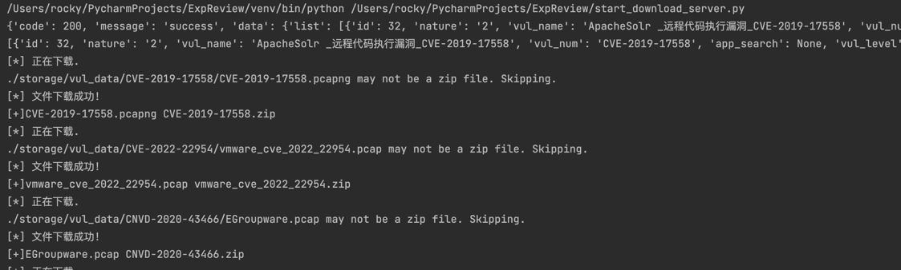
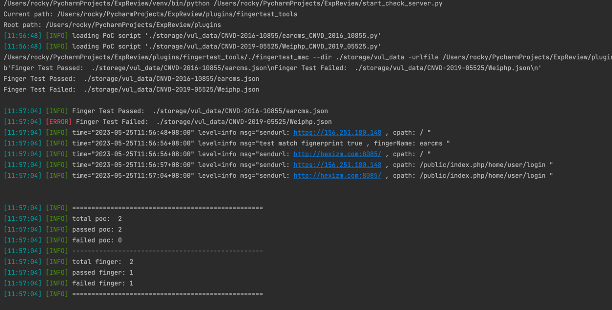

#ExpReview

## 安装 Python 虚拟环境

Python 的虚拟环境可以帮助我们管理项目的依赖，避免不同项目之间的依赖冲突。这是在 Python 中创建虚拟环境的步骤：

## 安装 virtualenv

首先，我们需要安装 `virtualenv`。在终端中运行下面的命令：

```bash
pip install virtualenv
```

创建虚拟环境 然后，我们可以创建一个虚拟环境。运行下面的命令：


```virtualenv venv```

这将在当前目录下创建一个名为 "venv" 的虚拟环境。

激活虚拟环境

要使用虚拟环境，我们需要先激活它。在终端中运行下面的命令：

```source venv/bin/activate```

## 程序安装部署

```git clone https://github.com/TTSecTeam/ExpReviewCheck.git```

```python -m pip install -r requirements.txt```

```cp env.example .env```

配置 env 

```
Cookie='' ``
Front_Cookie='' ``
Authorization='' `对外poc平台cookie`
```

## 使用方法

```start_download_server.py``` 开始自动下载,自动解压,删除原始压缩包,文件对外POC平台的待审核的EXP、指纹、流量包等。



```start_check_server.py``` 开始自动检测，是否符合本脑规定的格式,如果发现新的app_name,会自动添加到```config_list.json```



**注意** 指纹检测漏洞数量越多检测时间越长。


